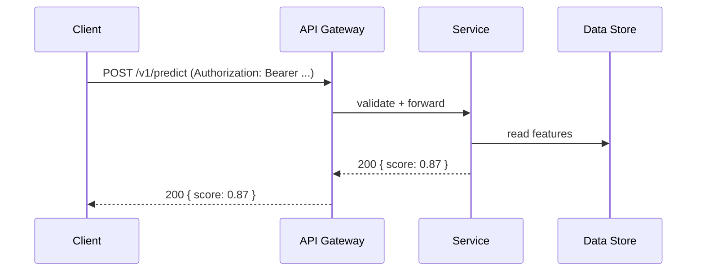

# Project Spec Template (Design-Only)
Use this template to define your prediction/design project. Keep it concise (2-3 pages max) and link to supporting artifacts where appropriate.

## 1) User & Decision
*   Who will use this? What decision does your prediction/design inform?

## 2) Target & Horizon
*   Target (binary/numeric/ETA) and when it's defined (e.g., next 5 minutes, this session, by deadline).

## 3) Features (No Leakage)
*   Only information available at prediction time. Note what you exclude to avoid leakage.

## 4) Baseline → Model Plan
*   Baseline you can implement immediately (rule/heuristic).
*   One simple model (e.g., logistic/tree/ETS) and why it's better (hypothesis).

## 5) Metrics, SLA, and Cost
*   Metric(s): AUC-PR/MAE/etc. State why they fit harms/benefits.
*   SLA: p95 latency, max cost per 10k predictions.

## 6) API Sketch (if applicable)
Purpose: make the contract obvious so a reviewer can "call it in their head". Keep to one page.

### 6.1 Endpoints (table)

| Method | Path | Purpose (1 line) | Auth? |
| :--- | :--- | :--- | :--- |
| POST | /v1/predict | Run model, return score | Bearer |
| GET | /v1/health | Liveness only | None |

Notes: versioning (e.g., /v1), rate limits (e.g., 60 req/min), idempotency key if relevant.

### 6.2 Request/Response examples (JSON)
Request (POST /v1/predict):
```json
{ "user_id": "12345", "features": { "age": 42, "region": "BC" } }
```
Response (200):
```json
{ "score": 0.87, "explanation": null }
```
Error (422):
```json
{ "error": "invalid_payload", "fields": ["age"] }
```

### 6.3 Auth scheme
Where does the token go? Example: Authorization: Bearer ... (even if stubbed for P1).

## 7) Privacy, Ethics, Reciprocity (PIA excerpt)
*   Data inventory, purpose limitation, retention, access (link your PIA).
*   Telemetry decision matrix (value vs invasiveness vs effort).
*   Guardrails: k-anonymity, jitter/aggregation, opt-ins, disclosure.
*   Reciprocity: value returned and to whom.

## 8) Architecture Sketch (1 diagram)
Show how the system works beyond the API surface. Include 6-8 boxes (Client, API Gateway/Ingress, Compute, Data Store, Auth provider, Observability), arrows for flow, and label guardrails (retention TTLs, k-anonymity/jitter if applicable) and external dependencies (e.g., CDN, payments). Note 1-2 trade-offs/alternatives.

Optional: add a single happy-path sequence diagram to make flow crystal clear:

Rubric alignment: clarity on API + metrics/SLA, privacy guardrails labeled, architecture feasibility/trade-offs.

## 9) Risks & Mitigations
*   Top 3 risks (technical/ethical) and how you will test or reduce them.

## 10) Measurement Plan
*   One minimal experiment to validate the baseline vs model (offline acceptable).
*   How you will measure SLA (latency/cost).

## 11) Evolution & Evidence
*   Link a git hash (or range/tag) that shows the design's evolution (commits, README updates, diagrams).
*   Insight memo link (3 insights), assumption audit, and Socratic log references.